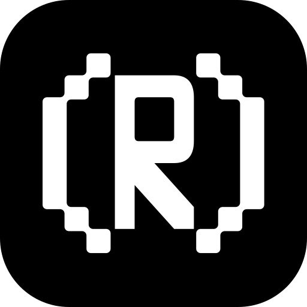

  
  <h1>Term/UI</h1>
  
Part of the <a href="https://rust-ui.com">Rust/UI ecosystem</a>.

  
shadcn/ui for the terminal: copyable Ratatui widgets for Rust apps.

  
<a href="https://termui.rustify.app">Browse the widgets</a>

